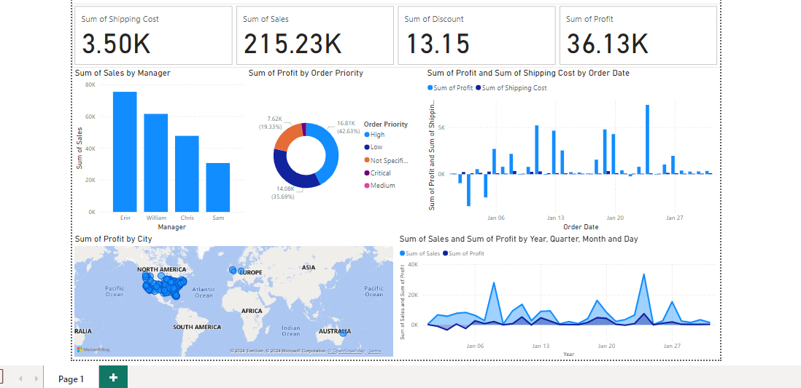

#  Power BI Dashboard 📊

This repository contains a **Power BI Dashboard** to analyze business metrics like **Sales**, **Profit**, **Discounts**, and **Shipping Costs**.

---

## **Dashboard Overview**

### Key Metrics:
- 📦 **Sum of Shipping Cost**: `3.50K`
- 💰 **Sum of Sales**: `215.23K`
- 🎯 **Sum of Discount**: `13.15`
- 📊 **Sum of Profit**: `36.13K`

### Visuals:
1. **Sales by Manager**: Compare sales performance (Erin, William, Chris, Sam).
2. **Profit by Order Priority**: Distribution of profits by priority (High, Medium, Low).
3. **Profit and Shipping Cost Over Time**: Analyze trends by order date.
4. **Profit by City**: Geographical profit distribution.

---

## **Dashboard Screenshot**



---

## **Files in the Repository**

| File Name   | Description                        |
|-------------|------------------------------------|
| `powerbi.pbix`  | Power BI file with the dashboard.  |
| `Capture.PNG` | Screenshot of the dashboard preview. |

---

## **How to Use This Dashboard**

1. Clone the repository:
   ```bash
   git clone https://github.com/anilamrute/powerbi-dashboard.git
